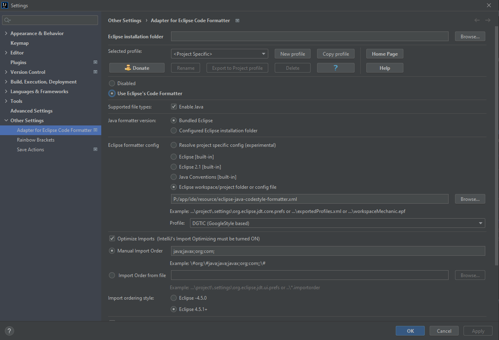
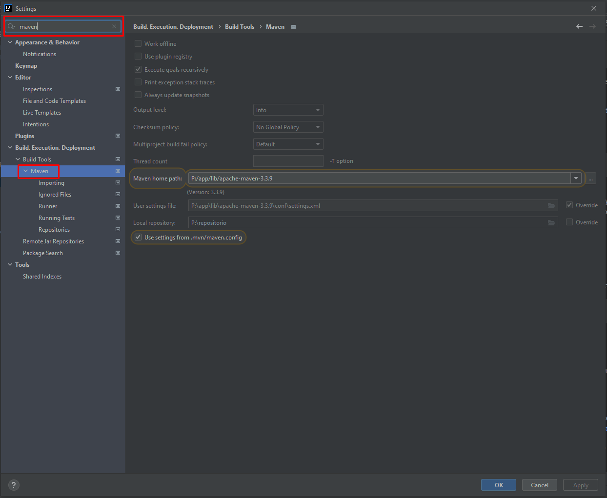
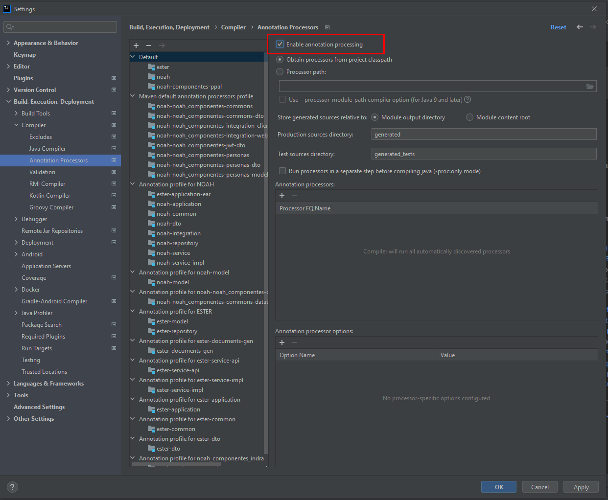

# CursoZK - Proyecto para pruebas y formación

Aplicación web de ZK lista para desplegar mediante war.

## Pre-requisitos - Instalación de la aplicacion

* Solicitar acceso al repositorio donde está alojado el proyecto base para el curso: **URL PENDIENTE**
* Tener el entorno de desarrollo que se os facilitara en el curso: **URL PENDIENTE**
* Tener un IDE para desarrollar en Java, aqui usaremos Eclipse o Intellij.

## Configuración del entorno

> 1. Descomprimimos el entorno de desarrollo en la raíz del disco D
> 2. Accedemos a la carpeta y ejecutamos el start.bat que nos generará un disco virtual llamado P
> 3. Con todo esto abrimos el IDE seleccionado para proceder a descargar y configurar el proyecto.

### Intellij

Pasos a seguir

> 1. Ir a la web oficial de intellij y descargar e intalar la [Community Edition](https://www.jetbrains.com/idea/download/#section=windows)
>    * En caso de necesitar alguna versión específica, dentro del enlace a la izquierda tenemos la opcion "Other versions"
> 2. Una vez abierto el IDE, iremos a File > Settings y comenzaremos con la configuración
>    * Ir a la sección plugins buscar e instalar del marketplace, al terminar reiniciar el IDE:
>      * ZK: Plugin para que el IDE reconozca los ficheros especificos del framework
>      * SonarLint: Plugin para que el IDE te reconozca los errores mas comunes de java y te los resalte para corregirlos
>      * JavaDoc: Plugin para autogenerar codigo JavaDoc para documentar los procesos
>      * Adapter for Eclipse Code Formatter: Plugin para hacer compatibles los code formatter de eclipse
>      * Save Actions: Plugin que lanza acciones por defecto al guardar un fichero
>    * Configurar "Adapter for Eclipse Code Formatter":
>      
>    * Configurar "Save Actions":
>      
>    * Configurar Maven:
>      
> 3. Si la versión es anterior a la versión 2020.3 es necesario intalar el plugin de Lombok. File > Settings > Plugins > Marketplace > Lombok
> 4. Puede darse el caso de que no te reconozca algunas anotaciones del proyecto y te las marque en rojo como @Getter, @Setter, @NoArgsConstructor... ***en ese caso*** proceder a marcar el check de la imagen
>    

### Eclipse

Pasos a seguir

> PENDIENTE

